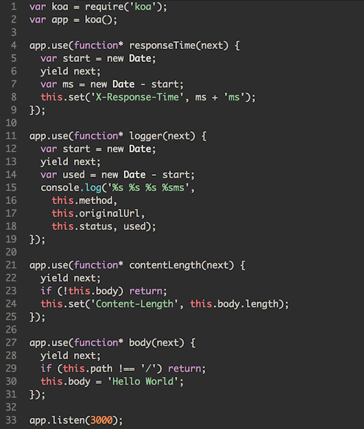

## 使用场景

一个 HTTP 请求进来后，会执行一系列的处理，然后返回响应给用户。

这个过程就像一条管道，管道的每一个切面逻辑，我们称之为 `Middleware`，也叫 `中间件`。

框架继承于 `Koa`，在 `Koa` 里面有个更形象的术语：`洋葱模型`。


`Koa` 中间件执行顺序：



## 编写中间件

我们约定把中间件放置在 `app/middleware` 目录下：

```js
// app/middleware/response_time.js
module.exports = () => {
  return async function responseTime(ctx, next) {
    const start = Date.now();
    await next();
    const cost = Date.now() - start;
    ctx.set('X-Response-Time', `${cost}ms`);
  }
};
```

如上，需 exports 一个普通的 function，返回一个标准的 Koa Middleware 函数。

## 加载规则

框架会把 `app/middleware` 目录下的文件挂载到 `app.middleware` 上。

支持多级目录，注意：**对应的文件名会转换为驼峰格式**。

```js
app/middleware/api/auth.js => app.middleware.api.auth
app/middleware/response_time.js => app.middleware.responseTime
app/middleware/BlockBot.js => app.middleware.blockBot
```

## 使用中间件

由于中间件是洋葱模型的一部分，因此**需要应用开发者显式挂载，决定它们的顺序**。

```js
// config/config.default.js
module.exports = {
  // 注意是驼峰格式
  middleware: [ 'responseTime' ],
};
```

## 自定义配置

一般来说中间件也会有自己的配置。

我们可以把之前的中间件改造如下：

```js
// app/middleware/response_time.js
module.exports = (options, app) => {
  return async function responseTime(ctx, next) {
    const start = Date.now();
    await next();
    const cost = Date.now() - start;
    // `options.headerKey` 等价于 `app.config.responseTime.headerKey`
    ctx.set(options.headerKey, `${cost}ms`);
  }
};
```

如上，接受两个参数：

- `options`: 中间件的配置项，框架会将 `app.config[${middlewareName}]` 传递进来。
- `app`: 当前应用 Application 的实例。

对应的配置：

```js
// config/config.default.js
module.exports = {
  middleware: [ 'responseTime' ],

  // key 为驼峰格式
  responseTime: {
    headerKey: 'X-Response-Time',
  },
};
```

## 通用配置

中间件支持以下几个通用的配置项：

- `enable`：控制中间件是否开启。
- `match`：设置只有符合某些规则的请求才会经过这个中间件。
- `ignore`：设置符合某些规则的请求不经过这个中间件。

### enable

如果我们的应用并不需要默认的 `bodyParser` 中间件来进行请求体的解析，此时我们可以通过配置来关闭它。

```js
module.exports = {
  bodyParser: {
    enable: false,
  },
};
```

### match 和 ignore

如果我们想让 `responseTime` 只针对 API 请求开启，我们可以配置：

```js
module.exports = {
  responseTime: {
    match: '/api',
  },
};
```

`match` 和 `ignore` 支持多种类型的配置方式，两者互斥不允许同时配置。

- `字符串`：当参数为字符串类型时，配置的是一个 URL 的路径前缀，所有以配置的字符串作为前缀的 URL 都会匹配上。当然，你也可以直接使用字符串数组。
- `正则`：当参数为正则时，直接匹配满足正则验证的 URL 的路径。
- `函数`：当参数为一个函数时，会将请求上下文传递给这个函数，最终取函数返回的结果（true/false）来判断是否匹配。

```js
module.exports = {
  responseTime: {
    match(ctx) {
      return ctx.url.startsWith('/api');
    },
  },
};
```

详见 [egg-path-matching](https://github.com/eggjs/egg-path-matching)。

## 修改内置中间件的配置

除了应用层加载中间件之外，框架自身和其他的插件也会加载许多中间件。

如果开发者期望自定义对应的配置，可以修改同名配置项进行覆盖。

如框架内置的 `bodyParser` 中间件，可以自定义配置如下：

```js
// config/config.default.js
module.exports = {
  bodyParser: {
    jsonLimit: '10mb',
  },
};
```

## 路由中间件

如果 `match` / `ignore` 不能满足你的需求，如你期望在不同的路由中使用不同的配置。

则可以在[路由](./router.md)中单独初始化和挂载：

```js
// app/router.js
module.exports = app => {
  // 初始化
  const responseTime = app.middleware.responseTime({ headerKey: 'X-Time' }, app);

  // 仅挂载到指定的路由上
  app.router.get('/test', responseTime, app.controller.test);
};
```

## 引入 Koa 生态

我们也可以非常容易的引入 Koa 中间件生态。

以 [koa-compress](https://github.com/koajs/compress) 为例，在 Koa 中使用时：

```js
const koa = require('koa');
const compress = require('koa-compress');

const app = koa();

const options = { threshold: 2048 };
app.use(compress(options));
```

在我们的应用中，会更简单一些，只需：

```js
// app/middleware/compress.js
// koa-compress 暴露的接口 `(options) => middleware` 和框架要求一致
module.exports = require('koa-compress');
```

对应的配置：

```js
// config/config.default.js
module.exports = {
  middleware: [ 'compress' ],
  compress: {
    threshold: 2048,
  },
};
```

如果使用到的 Koa 中间件不符合入参规范，则可以自行处理下：

```js
// config/config.default.js
module.exports = {
  webpack: {
    compiler: {},
    others: {},
  },
};

// app/middleware/webpack.js
const webpackMiddleware = require('some-koa-middleware');

module.exports = (options, app) => {
  return webpackMiddleware(options.compiler, options.others);
};
```

## 编写测试

类似于 [Controller](./controller.md) 的测试，通过 `app.httpRequest` 来测试。

```js
// test/controller/home.test.js
const { app, mock, assert } = require('egg-mock');

describe('test/middleware/response_time.test.js', () => {
  it('should response header', () => {
    return app.httpRequest()
      .get('/api/test')
      .expect('X-Response-Time', /\d+ms/);
  });
});
```

具体的单元测试运行方式，参见 [研发流程 - 单元测试](../workflow/development/unittest.md) 文档。
