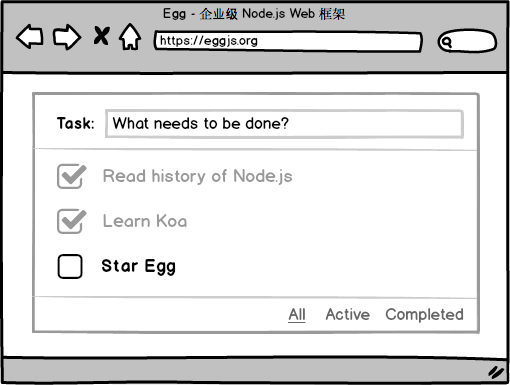

在本章中我们先来学习如何写一个简单的 `Egg` 应用，通过它来了解一些基本的概念和术语。

:::tip 友情提示
需注意的是，本文介绍的是 `Egg` 的基础使用。
对于 `Egg` 的开发者而言，很多插件无需自行安装，已经内置到框架，直接开启即可。
更多内容，在[开发指南](../guide/README.md)中可以了解到。
:::

## 典型场景

我们以 [TodoMVC](http://todomvc.com/) 这个典型的前端应用场景为例，一步步从零开始搭建。

完整的源码参见 [eggjs/examples/todomvc](https://github.com/eggjs/examples/tree/master/todomvc)。



## 逐步搭建

### 环境准备

- 操作系统：支持 `macOS`，`Linux`，`Windows`，推荐本地开发用 `macOS`。
- 运行环境：仅需要 [Node.js](https://nodejs.org)，对应的安装参见[文档](./prepare.md)。

### 初始化项目

通过骨架来[初始化](../workflow/development/init.md)：

```bash
# 使用 `Egg` 的 `simple` 骨架来初始化
$ mkdir demo && cd demo
$ npm init egg --type=simple
$ npm install
```

### 目录结构

框架奉行『约定优于配置』，所以我们首先来看看生成的目录结构，更多可以参见[目录规范](../guide/directory.md)。

```bash
demo
├── app
│   ├── controller # 控制器
│   │   └── home.js
│   └── router.js  # 路由映射
├── config # 配置文件
│   ├── config.default.js
│   └── plugin.js
├── test # 单元测试
├── README.md
└── package.json
```

### `Controller`

[Controller](../guide/controller.md) 负责**解析用户的输入，处理后返回相应的结果**。

```js
// app/controller/home.js
const { Controller } = require('egg');

class HomeController extends Controller {
  async index() {
    const { ctx } = this;
    ctx.body = 'hi, egg';
  }
}

module.exports = HomeController;
```

接着配置 [路由](../guide/router.md) 映射到对应的 `URL` 上。

```js
// app/router.js
/**
 * @param {Egg.Application} app - egg application
 */
module.exports = app => {
  const { router, controller } = app;
  router.get('/', controller.home.index);
};
```

### 本地开发

框架提供了[本地开发](../workflow/development/development.md)的辅助工具。

- 辅助本地启动应用，监控代码变更自动重启。
- 自动生成 `d.ts` 文件，提供 `智能提示` 和 `代码跳转` 等能力。

通过命令启动应用：

```bash
$ npm run dev
```

然后就可以访问 `http://127.0.0.1:7001`。

### 模板渲染

绝大多数情况，我们都需要读取数据后渲染模板，然后呈现给用户。

但 `Egg` 并不强制你使用某种模板引擎，故我们需要引入对应的『插件』。

:::tip 术语讲堂
插件机制是我们框架的一大特色。它不但可以保证框架核心的足够精简、稳定、高效，还可以促进业务逻辑的复用，生态圈的形成。
详见[开发指南 - 插件](../guide/plugin.md)文档。
:::

在本章中，我们使用 [Nunjucks] 来渲染，先安装对应的插件 [egg-view-nunjucks] ：

```bash
$ npm i egg-view-nunjucks --save
```

开启插件：

```js
// config/plugin.js
exports.nunjucks = {
  enable: true,
  package: 'egg-view-nunjucks'
};
```

按照约定，在 `app/view` 目录下添加对应的模板文件：

```html
<!-- app/view/home.tpl -->
<html>
  ...
  <script src="/public/main.js"></script>
</html>
```

对应的 `Controller` 改为：

```js
class HomeController extends Controller {
  async index() {
    const { ctx } = this;
    // 渲染模板 `app/view/home.tpl`
    await ctx.render('home.tpl');
  }
}
```

### 静态资源

前端代码的发布，一般有：

- 构建后发布到 `CDN`。（推荐）
- 直接在应用中托管。

`Egg` 内置了 [egg-static] 插件，对后者提供了支持。

默认会把 `app/public` 目录映射到 `/public` 路由上。

在本例中，我们使用 `Vue` 来写对应的前端逻辑，可以直接参见示例代码。

:::warning 注意事项
- `static` 插件，线上会默认设置一年的 `maxAge`。
- 框架默认开启了 [CSRF 防护](../ecosystem/security/csrf.md)，故 `AJAX` 请求需要带上对应的 `token`：

```js
// app/public/main.js
axios.defaults.headers.common['x-csrf-token'] = Cookies.get('csrfToken');
```
:::

### 配置文件

写业务的时候，不可避免的需要有[配置文件](../guide/config.md)。

框架提供了强大的配置合并管理功能。

如上述的 `nunjucks` 插件，添加对应的配置：

```js
// config/config.default.js
config.view = {
  defaultViewEngine: 'nunjucks',
  mapping: {
    '.tpl': 'nunjucks',
    '.html': 'nunjucks',
  },
};
```

:::warning 注意事项
是 `config` 目录，不是 `app/config`!
:::

### `Service`

我们的业务逻辑一般会写在 [Service](../guide/service.md) 里，然后供 `Controller` 调用。

```js
// app/service/todo.js
const { Service } = require('egg');

class TodoService extends Service {
  /**
   * create todo
   * @param {Todo} todo - todo info without `id`, but `title` required
   */
  async create(todo) {
    // validate
    if (!todo.title) this.ctx.throw(422, 'task title required');

    // normalize
    todo.id = Date.now().toString();
    todo.completed = false;

    this.store.push(todo);
    return todo;
  }
}
```

对应的 `Controller` 如下：

```js
// app/controller/todo.js
class TodoController extends Controller {
  async create() {
    const { ctx, service } = this;

    // params validate, need `egg-validate` plugin
    // ctx.validate({ title: { type: 'string' } });

    ctx.status = 201;
    ctx.body = await service.todo.create(ctx.request.body);
  }
}
```

### `RESTful`

`Egg` 对 `RESTful` 这种常见的场景提供了[内建的支持](../guide/router.md#RESTful-风格的-URL-定义)：

```js
// app/router.js
module.exports = app => {
  const { router, controller } = app;

  // RESTful 映射
  router.resources('/api/todo', controller.todo);
};
```

对应的 `Controller`：

```js
// app/controller/todo.js
class TodoController extends Controller {
  // `GET /api/todo`
  async index() {}

  // `POST /api/todo`
  async create() {}

  // `PUT /api/todo`
  async update() {}

  // `DELETE /api/todo`
  async destroy() {}
}
```

### 单元测试

Web 应用中的单元测试非常重要，框架也提供了对应的[单元测试能力支持](../workflow/development/unittest.md)。

```js
// test/app/controller/todo.test.js
const { app, mock, assert } = require('egg-mock/bootstrap');

describe('test/app/controller/todo.test.js', () => {
  it('should add todo', () => {
    return app.httpRequest()
      .post('/api/todo')
      .send({ title: 'Add one' })
      .expect('Content-Type', /json/)
      .expect('X-Response-Time', /\d+ms/)
      .expect(201)
      .expect(res => {
        assert(res.body.id);
        assert(res.body.title === 'Add one');
        assert(res.body.completed === false);
      });
  });
});
```

[Node.js]: http://nodejs.org
[egg-static]: https://github.com/eggjs/egg-static
[egg-view-nunjucks]: https://github.com/eggjs/egg-view-nunjucks
[Nunjucks]: https://mozilla.github.io/nunjucks/